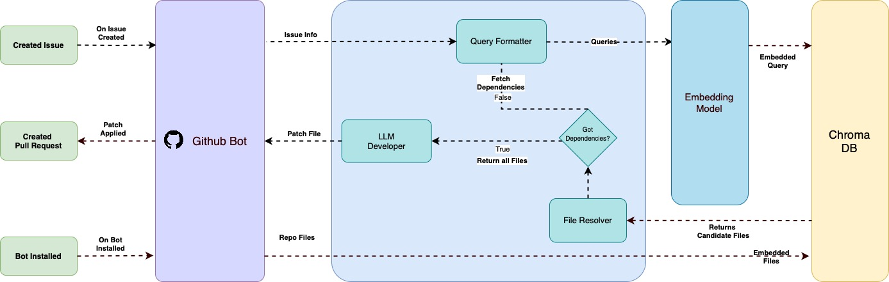

# kaizen-agent

🎥 **Final Video**: [Watch on Google Drive](https://drive.google.com/drive/folders/1JUUSBSZ8gI0v1EvNHYSuj9nErVkY-xjG?usp=sharing)

---

# Kaizen Copilot

**Kaizen Copilot** is an autonomous multi-agent system designed to resolve GitHub Issues as if it were another developer on the team. It uses a **RAG (Retrieval-Augmented Generation)** approach with an embedding model and a vector database to retrieve context from the repository and generate code solutions automatically.

---

## Objective

Build and deploy an agent using the **MCP (Model-Context-Protocol)** architecture that:

- Analyzes the context of a GitHub repository.
- Extracts and contextualizes relevant files.
- Resolves GitHub Issues by generating commits.
- Triggers automatically when the bot is installed or a new Issue is created.

---

## ⚙Installation

### 1. Prerequisites

- [Conda](https://docs.conda.io/projects/conda/en/latest/user-guide/install/index.html)

### 2. Clone the Repository

```bash
git clone https://github.com/C3RetoAI/kaizen-copilot.git
cd kaizen-copilot
```

### 3. Create the Environment

Install the project dependencies and activate the environment:

```bash
conda env create -f enviroment.yml
conda activate kaizen-copilot
```

---

## Architecture

Kaizen Copilot consists of several **agents** and **tools**, each with specific responsibilities. Its architecture follows the **MCP (Model-Context-Protocol)** pattern and is designed as a **RAG (Retrieval-Augmented Generation)** system to retrieve and use repository context effectively.



### Agents

- **LLM Contextualizer**  
  Enriches repository files with natural language context to improve semantic search accuracy.

- **Query Formatter**  
  Converts an Issue into a structured query used to search the Vector DB.

- **File Resolver**  
  Given a main file suggested by the Vector DB, analyzes local dependencies (e.g., imports or includes) and gathers additional context.

- **LLM Developer**  
  A fine-tuned or base model that generates a patch to solve the Issue using the retrieved context.

### 🛠️ Tools

- **GitHub Bot**  
  Manages interaction with GitHub. Detects events like installation, push, and issue creation. Clones the repo, collects metadata, coordinates agent flows, and applies solution commits.

- **Embedding Model**  
  Converts text into semantic vectors for storing and querying relevant repository content.

- **Vector DB (ChromaDB)**  
  Stores file embeddings with metadata such as file name, relative path, and file type. Enables fast and accurate semantic queries.
